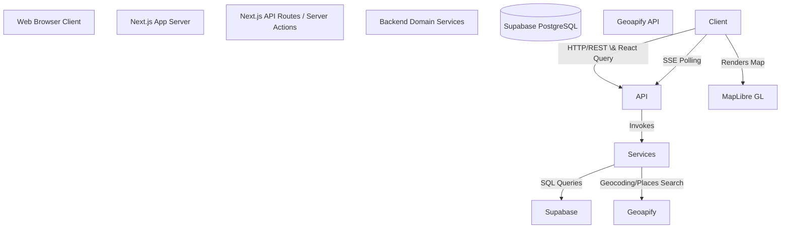

Viewed context-sync-map.yaml:1-231
Listed directory MiddleGround
Viewed package.json:1-38
Listed directory app
Listed directory components
Listed directory services
Listed directory lib

```markdown
# MiddleGround Architecture Document

## 1. Full System Architecture

MiddleGround is a collaborative meeting-point planner that calculates the geographic midpoint for a group of participants and suggests nearby venues (cafes, restaurants, pubs) around that location. 

The system follows a modern full-stack architecture built on Next.js App Router, using Serverless API routes and React Server Components.

\*\*High-Level Architecture \& Data Flow\*\*



**Component Communication:**

* **Frontend to Backend:** The React client uses RESTful calls (managed by `@tanstack/react-query`) to communicate with Next.js API routes (`app/api/\*`).
* **Realtime Events:** Real-time updates (e.g., when a participant joins or updates their location) are currently handled via a Server-Sent Events (SSE) shaped polling stream at `/api/plans/\[id]/events`. (Production recommendation is to migrate to Supabase Realtime subscriptions).
* **Backend to Database:** Next.js API routes offload business logic to Domain Services (e.g., `PlanService`, `PlacesService`), which use the `@supabase/supabase-js` client to query the Supabase PostgreSQL database.
* **External Services:** The `PlacesService` and frontend Server Actions call the external **Geoapify API** for geocoding and fetching venue suggestions.

\---

## 2\. Detailed Technology Stack

### Frontend Layer

* **Language**: TypeScript (^5.7.2)
* **Framework**: React (^19.1.0) \& Next.js (^15.5.0) App Router
* **State Management \& Data Fetching**: React Query (`@tanstack/react-query` ^5.90.0)
* **Styling**: Tailwind CSS (^3.4.17), PostCSS (^8.4.49), with custom global CSS mapping styles.
* **Icons**: Lucide React (`lucide-react` ^0.468.0)
* **Map Rendering**: MapLibre GL JS (`maplibre-gl` ^5.24.0) using open-source demotiles.
* **UI Components \& Toast**: Sonner (`sonner` ^1.7.0) for notifications.

### Backend Layer

* **Language \& Runtime**: TypeScript on Node.js (Types ^22.10.2)
* **Framework**: Next.js API Routes \& Server Actions
* **Authentication**: NextAuth.js v4 (`next-auth` ^4.24.11) configured with Credentials, GitHub, and Google providers. Password hashing via `bcryptjs` (^3.0.3).
* **Validation**: Zod (`zod` ^3.25.0) for DTO validation.
* **Caching**: `lru-cache` (^11.2.2) (used within `PlacesService` to cache Geoapify responses).
* **Utilities**: `nanoid` (^5.1.5) for secure token generation.

### Database \& Storage

* **Primary Database**: PostgreSQL (Managed by Supabase)
* **DB Client/ORM**: `@supabase/supabase-js` (^2.108.2) – lightweight client wrapper instead of a heavy ORM (like Drizzle) per project decisions.

### DevOps \& Infrastructure

* **Deployment Platform**: Vercel (Production-ready configuration)
* **Environment Management**: `.env.local` for local execution.
* **Package Manager**: npm

### Testing

* **Current State**: Manual testing and TypeScript static analysis (`npm run typecheck`).
* **Future Integration**: Playwright planned for end-to-end (e2e) UI testing of critical flows.

\---

## 3\. Project Folder Structure

```text
project-root/
├── app/                       # Next.js App Router (Frontend \& Backend entry points)
│   ├── api/                   # Backend REST endpoints and auth routes
│   │   ├── auth/              # \[...nextauth] configurations and /register
│   │   ├── places/            # Proxy for Geoapify to prevent exposing API key
│   │   ├── plans/             # CRUD for plans, locations, midpoints, and SSE polling
│   │   └── join/              # Token-based join verification
│   ├── dashboard/             # Private dashboard page for plan owners
│   ├── join/                  # Public dynamic route (/join/\[token])
│   ├── login/                 # Authentication page
│   ├── plans/                 # Plan workspace view (/plans/\[id])
│   ├── layout.tsx             # Root HTML layout and global metadata
│   ├── page.tsx               # Public landing page
│   └── providers.tsx          # Client wrappers (React Query, NextAuth Session)
├── components/                # React Client Components (Feature-grouped)
│   ├── auth/                  # Login and registration forms
│   ├── dashboard/             # Plan lists and creation modals
│   ├── join/                  # Plan joining flow logic
│   ├── map/                   # MapLibre map, markers, and midpoint rendering
│   ├── places/                # Places sidebar, venue cards
│   ├── plan/                  # PlanWorkspace, participant lists, owner controls
│   └── ui/                    # Reusable atom components (buttons, inputs)
├── hooks/                     # Custom React Query hooks wrapping API calls
├── lib/                       # Core configuration and client initializations
│   ├── auth/                  # NextAuth options (options.ts)
│   └── supabase/              # Supabase client instantiation
├── services/                  # Backend Domain Logic (Framework-agnostic logic)
│   ├── AuthService.ts         # User registration and DB synchronization
│   ├── LocationService.ts     # Internal location normalizers
│   ├── PlacesService.ts       # Geoapify proxy, LRU cache, and fallback venues
│   └── PlanService.ts         # Plan/Participant persistence, midpoint math logic
├── types/                     # Shared TypeScript DTOs and Data Models
├── utils/                     # Helper functions (Cartesian math, formatting)
├── .env.local                 # Local environment variables
├── middleware.ts              # Next.js Edge Middleware for route protection
├── supabase-schema.sql        # Database initialization script
└── package.json               # Dependencies and scripts
```

\---

## 4\. Dependency \& Import Graph

### Backend Request Flow Graph

Requests to API routes trace down to centralized services to keep controllers thin:

* `app/api/plans/\[id]/route.ts`
→ imports `services/PlanService.ts`
→ imports `lib/supabase/client.ts` (executes query on Supabase)
* `app/api/places/route.ts`
→ imports `services/PlacesService.ts`
→ calls external `Geoapify` API (with fallback to determinist local lists)
* `app/api/auth/\[...nextauth]/route.ts`
→ imports `lib/auth/options.ts`
→ uses `services/AuthService.ts` \& `bcryptjs`
→ validates against Supabase DB via `lib/supabase/client.ts`

### Frontend Render Graph

The application mounts via Next.js server components, passing control to client providers:

* `app/layout.tsx` (Server Component)
→ renders `app/providers.tsx` (Client Component providing QueryClient and SessionProvider)
→ renders `app/plans/\[id]/page.tsx`
→ imports and mounts `components/plan/PlanWorkspace.tsx`
→ imports `components/map/MapContainer.tsx` \& `components/places/PlacesSidebar.tsx`
→ calls hooks like `usePlan(id)` from `hooks/` which execute `fetch('/api/plans/\[id]')`

\---

## 5\. Startup \& Request Flow

### Backend Startup Sequence

1. **Process Initialization:** Developer runs `npm run dev` (or Vercel starts the Node.js lambda). Next.js boot sequence begins.
2. **Environment Loading:** Next.js loads environment variables from `.env.local` or deployment settings (e.g., `NEXT\_PUBLIC\_SUPABASE\_URL`, `GEOAPIFY\_API\_KEY`).
3. **Middleware Registration:** `middleware.ts` runs at the Edge to intercept incoming requests, checking NextAuth session tokens to protect `/dashboard` and `/plans/\*` routes.
4. **Client Initialization (Lazy):**

   * Supabase client (`lib/supabase/client.ts`) initializes connection pooling on first use.
   * NextAuth initializes providers and session strategies (`lib/auth/options.ts`).
5. **Ready:** The HTTP server listens on port 3000.

### Frontend Startup Sequence

1. **Bundle Delivery:** User navigates to `http://localhost:3000/`. Next.js serves the initial HTML and JS bundles.
2. **Framework Mount:** React hydrates the DOM inside `app/layout.tsx`.
3. **Context Providers:** `app/providers.tsx` mounts, initializing `@tanstack/react-query`'s cache and NextAuth's `SessionProvider`.
4. **Initial Data Fetch:** The UI renders the active page, triggering React Query hooks which make background `fetch` calls to Next.js API routes.

### End-to-End Request Flow: Creating a Plan

Here is a step-by-step trace of a typical user action (Creating a new meeting plan):

1. **User Interaction:** The user, authenticated and on `/dashboard`, types a plan name and clicks "Create Plan" inside `components/dashboard/CreatePlanForm.tsx`.
2. **Frontend API Call:** The component triggers a React Query mutation, which executes an HTTP `POST` to `/api/plans` with the payload `{ name: "Lunch Meeting" }`.
3. **Middleware Processing:** `middleware.ts` validates the session cookie. Since the user is authenticated, the request is allowed through.
4. **Route Handler:** `app/api/plans/route.ts` receives the request. It retrieves the user's session ID using NextAuth's `getServerSession`.
5. **Service Layer:** The route handler delegates logic to `PlanService.createPlan({ name: "Lunch Meeting" }, userId)`.
6. **Database Operation:** `PlanService` leverages `lib/supabase/client.ts` to execute an `INSERT INTO plans` SQL command to the Supabase PostgreSQL database.
7. **Response Generation:** Supabase returns the newly created plan object. The route handler returns it to the client with a `200 OK` JSON response.
8. **Frontend State Update:** React Query receives the response, caches the new plan, and invalidates the `\['plans']` list query.
9. **UI Re-render:** The frontend redirects the user to the newly created plan's workspace at `/plans/\[id]`.

```

